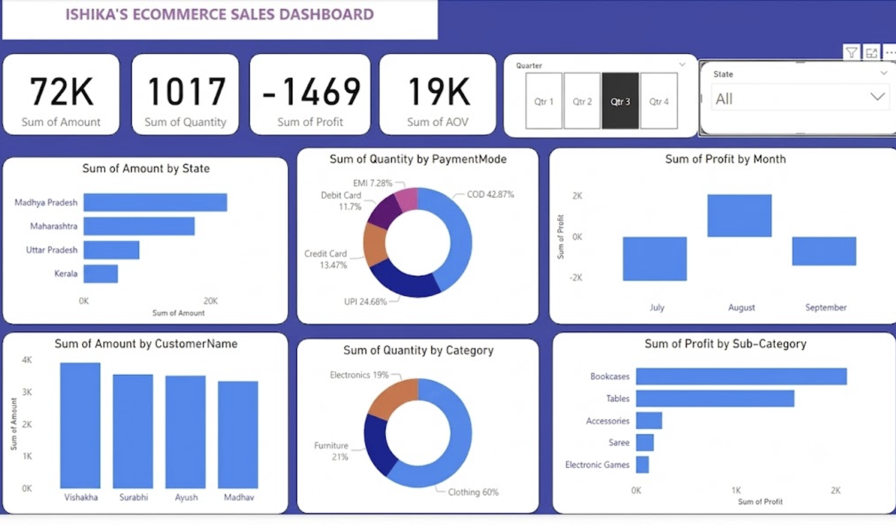

# E-Commerce-Sales-Analytics-Dashboard
This interactive Power BI dashboard provides comprehensive insights into an e-commerce platform’s sales performance across time, regions, and product categories.

## 📌 Key Features
- **Monthly Revenue Trends** – Analyze how revenue changes over months.
- **Top-Selling Products** – Visualize the most profitable products.
- **Region-wise Sales** – Identify which regions perform best.
- **Customer Segmentation** – Explore customer types and behaviors.
- **Interactive Filters** – Slicers for product category, region, and time period.

## 🔧 Tools Used
- Power BI Desktop
- DAX for calculated columns and measures
- Power Query for data cleaning and transformation

## 🖼️ Preview

## 📂 Files Included
- `project.pbix`: Power BI report file
- `exported_report.pdf`: A PDF version of the dashboard
- `images/`: Contains dashboard screenshots
- `data/`: Sample or mock data (if included)

## 📎 How to Use
1. Clone or download the repository.
2. Open the `.pbix` file using Power BI Desktop.
3. Interact with the visuals and filters to explore insights.
